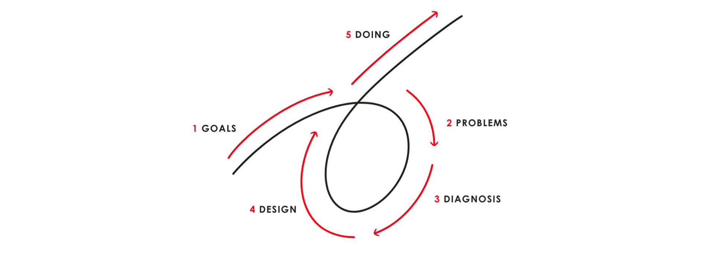

# 如何成功
在我讨论如何成功之前，我想先定义一下，什么是成功？当然，有人说，成功不就是有钱吗！确实如此，世俗异议上的成功和钱都脱不开关系。经常被提及的成功人士，比如比尔盖茨，沃伦巴菲特，埃隆马斯克，马云。都曾当过世界或者自己国家的首富。他们的资产能顶上一个中小国家的GDP，说是富可敌国一点也不夸张。他们当然是取得了成功。 但实际上，**他们只是达成了自己的目标而已**。   比尔盖茨的目标：想让每个家庭的桌面上都有一台电脑，所以创建了微软，马云的目标：服务中小卖家让天下没有难做的生意，所以创建了阿里巴巴，马斯克想要登上火星，所以创建了SpaceX，想要用清洁能源保护环境，所有创建了Tesla和SolarCity，巴菲特的目标则实际多了，想要成为亿万富翁。马斯克虽然还没有登上火星，但是他们或多或少都达成了自己的目标。既获得了世俗意义上的成功，也真正做到了自己想做的事情。

**简单的说，成功就是达成了自己的目标，做到了自己想做的事情。**

那么，如何达成目标？

全球最大的对冲基金创始人**瑞·达利欧（Ray Dalio）**将自己个人哲学写成了一本书----**《原则》**。他在书里分享了自己实现人生愿望的方法：
1. 有明确的目标。
2. 找到阻碍你实现这些目标的问题，并且不容忍问题。
3. 准确诊断问题，找到问题的根源。
4. 规划可以解决问题的方案。
5. 做一切必要的事来践行这些方案，实现成果。

如果你能把这5件事都做好，那你几乎肯定可以成功。

关于达利欧的论述可以总结为以下几点：
1. 首先，你要选择你追求什么，什么是你的目标，目标应该明确，不能含含糊糊。
2. 其次，找到阻碍实现目标的问题和问题的根源，也就是对目标进行彻底的本质上的思考，找到实现目标根本上需要实现的关键点。
3. 在次，规划实现目标的方案，把方案细化到每一个可以被具体执行的任务上。
4. 最后，坚决的执行任务，直到最终实现成果。

基于以上的想法，我给自己做了一个工具，用来帮助自己执行这些步骤。

1. **目标管理**：采用了Google和字节等互联网大厂一直在推广的OKR方法，可以周期性的设定目标(Objective)，同时基于自己的目标，找到最根本的关键结果(Key Results) 。在实现目标的过程中，可以对目前的进度和完成情况做记录，方便掌握节奏。
2. **任务规划**：采用了GTD做任务管理系统，并且在任务的分配优先级上采用了由前美国艾森豪威尔(Dwight D. Eisenhower)发明的时间管理四象限。将任务划分成紧急且重要，紧急不重要，重要不紧急，不重要不紧急四类。
3. **任务执行**：用了番茄工作法(Pomodoro)，记录每一次的任务执行。同时还加入了白噪声功能，让自己在工作的时候能够全神贯注，隔绝外界环境。
4. **时间统计**：对于每天的工作，还需要知道一分钟都花在了哪里，哪个任务，哪个OKR上，所以我们统计了每一分钟，然后用图标的形式展示。方便分析，更有效率的使用自己的时间。

希望它也能帮助到你，在你走向成功的道路上，提供最先进的生产力！

> 需要注意的是番茄工作法是1980年代产生，四十多年的时间虽然验证了该方法的有效性，但是不是所有类型的工作都应该设定为25分钟的工作块。例如程序员在写代码的时候是需要长时间的专注，25分钟会打乱节奏，导致碎片化。我个人一般是设定2小时工作块。所以建议根据个人的具体工作灵活设定时长。

